# Encoder Design for SVT-AV1 (Scalable Video Technology for AV1 Encoder)

## Table of Contents
- [Revision History](#revision-history)
- [Table of Contents](#table-of-contents)
- [List of Figures](#list-of-figures)
- [List of Tables](#list-of-tables)
- [Introduction](#introduction)
- [Definitions](#definitions)
  * [General Definitions](#general-definitions)
  * [Source Partitioning](#source-partitioning)
- [High-level encoder architecture](#high-level-encoder-architecture)
- [Inter-process data and control management](#inter-process-data-and-control-management)
  * [Objects](#objects)
    * [Sequence Control Set](#sequence-control-set)
    * [Picture Control Set](#picture-control-set)
    * [Picture Descriptors](#picture-descriptors)
    * [Results](#results)
  * [System Resource Manager (SRM)](#system-resource-manager-srm)
    * [Resource manager components](#resource-manager-components)
      * [Empty object FIFO](#empty-object-FIFO)
      * [Producer empty object FIFO](#producer-empty-object-FIFO)
      * [Producer process](#producer-process)
      * [Producer process FIFO](#producer-process-FIFO)
      * [Full object FIFO](#full-object-FIFO)
      * [Consumer full object FIFO](#consumer-full-object-FIFO)
      * [Consumer process](#consumer-process)
      * [Consumer process FIFO](#consumer-process-FIFO)
    * [Resource manager execution flow snapshot](#resource-manager-execution-flow-snapshot)
  * [High-level Data Structures](#high-level-data-structures)
    * [Configuration Set](#configuration-set)
    * [Sequence Control Set (SCS)](#sequence-control-set-scs)
    * [Picture Control Set (PCS)](#picture-control-set-pcs)
    * [Picture Descriptors](#picture-descriptors)
- [Encoder Processes and Algorithms](#encoder-processes-and-algorithms)
  * [Resource Coordination Process](#resource-coordination-process)
  * [Picture Analysis Process](#pictureanalysisprocess)
    * [Statistical Moments](#statistical-moments)
  * [Picture Decision Process](#picture-decision-process)
  * [Motion Estimation Process](#motion-estimation-process)
    * [Hierarchical Motion Estimation](#hierarchical-motion-estimation)
    * [Search Center Selection](#search-center-selection)
    * [Motion Estimation](#motion-estimation)
      * [Motion Estimation Integer Full-Search](#motion-estimation-integer-full-search)
      * [Motion Estimation Half-Pel Refinement](#motion-estimation-half-pel-refinement)
      * [Motion Estimation Quarter-Pel Refinement](#motion-estimation-quarter-pel-refinement)
  * [Initial Rate Control Process](#initial-rate-control-process)
  * [Source-based Operations Process](#source-based-operations-process)
  * [Picture Manager Process](#picture-manager-process)
  * [Rate Control Process](#rate-control-process)
  * [Partitioning, Mode Decision and Encoding](#partitioning,-mode-decision-and-encoding)
    * [Mode Decision Configuration Process](#mode-decision-configuration-process)
    * [EncDec Process](#encdec-process)
      * [Neighbor Array](#neighbour-array)
      * [Rate Estimation Tables](#rate-estimation-tables)
      * [Candidate Types](#candidate-types)
        * [Intra Candidates](#intra-candidates)
        * [Inter Candidates](#inter-candidates)
        * [Compound Candidates](#compound-candidates)
      * [Encode SB](#encode-sb)
        * [Encode SB](#endode-sb)
        * [Encode SB](#encode-sb)
  * [Loop Filter Process](#loop-filter-process)
  * [Constrained Directional Enhancement Filter Process](#constrained-directional-enhancement-filter-process)
  * [Restoration Filter Process](#restoration-filter-process)
  * [Entropy Coding Process](#entropy-coding-process)
  * [Packetization Process](#packetization-process)
- [Detailed Feature Implementation Design Appendices](#detailed-feature-implementation-design-appendices)
  * [Altref Appendix](Appendix Alt Refs)
  * [CDEF Appendix](Appendix CDEF)
  * [CfL Appendix](Appendix CfL)
  * [Compliant Subpel Interpolation Filter Search Appendix](Appendix Compliant Subpel Interpolation Filter Search)
  * [Deblocking Loop Filter (LF) Appendix](Appendix DLF)
  * [Filter Intra Appendix](Appendix Filter Intra)
  * [Global Motion Appendix](Appendix GM)
  * [Intra Block Copy Appendix](Appendix Intra Block Copy)
  * [Local Warped Motion appendix](Appendix Local Warped Motion)
  * [OBMC Appendix](Appendix OBMC)
  * [Palette Prediction Appendix](Appendix Palette Prediction)
  * [Restoration Filter Appendix](Appendix Restoration Filter)
  * [Subpel Interpolation in the Open Loop Motion Estimation Appendix](Appendix Subpel Interpolation Open Loop ME)
- [Legal Disclaimer](#legal-disclaimer)

## List of Figures
- [Figure 1](#figure-1): Five-layer prediction structure used in the SVT-AV1 encoder with one reference picture in each direction.
- [Figure 2](#figure-2): Picture partitioning diagram.
- [Figure 3](#figure-3): High-level encoder process dataflow.
- [Figure 4](#figure-4): Detailed encoder process dataflow.
- [Figure 5](#figure-5): Illustration of segment-based processing: The squares in the picture represent segments. Light yellow segments
                         have already been processed. Dark yellow segments are being processed in a parallel manner.
- [Figure 6](#figure-6): System resource manager dataflow.
- [Figure 7](#figure-7): Picture decision process dataflow.
- [Figure 8](#figure-8): An example of a four-layer prediction structure.
- [Figure 9](#figure-9): Hierarchical motion estimation dataflow.
- [Figure 10](#figure-10): Hierarchical motion estimation data illustration.
- [Figure 11](#figure-11): Search center select and motion estimation.
- [Figure 12](#figure-12): Motion estimation dataflow.
- [Figure 13](#figure-13): Motion Estimation Integer Full-Search for the case of 64x64 SB. 4xN and Nx4 blocks are not included
                           in this diagram to keep the presentation simple.
- [Figure 14](#figure-14): Half-Pel Refinement for the case of 64x64 SB. 4xN and Nx4 blocks are not included in this
                           diagram to keep the presentation simple.
- [Figure 15](#figure-15): Quarter-Pel Refinement for the case of 64x64 SB. 4xN and Nx4 blocks are not included in
                           this diagram to keep the presentation simple.
- [Figure 16](#figure-16): Initial Rate Control Process Dataflow.
- [Figure 17](#figure-17): Picture Management Dataflow.
- [Figure 18](#figure-18): Partitioning decision stages.
- [Figure 19](#figure-19): Example of the processing details in each PD stage.
- [Figure 20](#figure-20): Partitioning, mode decision, encoding and filtering tasks.
- [Figure 21](#figure-21): Neighbor array structure.
- [Figure 22](#figure-22): Neighbor array data illustration.
- [Figure 23](#figure-23): MD flow in a single PD stage.

## List of Tables
- [Table 1](#table-1): Examples of Configuration Set Members.
- [Table 2](#table-2): Examples of Sequence Control Set Members.
- [Table 3](#table-3): Examples of Picture Parent Control Set Members.
- [Table 4](#table-4): Examples of Picture Descriptor Members.
- [Table 5](#table-5): Settings for the show_frame and Show_existing_frame flags when encoding
                       one mini-GoP in a 4-layer prediction structure.
- [Table 6](#table-6): Description of the picture depth mode settings.
- [Table 7](#table-7): Blocks to be considered in MD as a function of picture depth mode.

## Introduction

This document describes the Intel SVT-AV1 encoder design. In particular,
the encoder block diagram and system resource manager are described. In
addition, the document contains detailed descriptions of the SVT-AV1
encoder-specific algorithms such as those used for motion estimation,
mode decision, quantization, etc. This document is meant to be an
accompanying document to the “C Model” source code, which contains the
more specific details of the inner workings of each algorithm.

## Definitions

This section contains definitions used throughout this design document.

### General Definitions

|  **Term** |  **Definition** |
|---|---|
| Picture  |  Collection of luma and chroma samples assembled into rectangular regions with a width, height and sample bit-depth. |
|  Super block (SB) |  A square block of luma and chroma samples defined to have a size of either 64 or 128 luma samples. |
|Block|  A square or rectangular region of data that is part of a SB and that is obtained through the partitioning of the SB. |
| Transform block  | A square or rectangular region of data whose size is the same as or smaller than the size of the corresponding block. |
| Bitstream  | A collection of bits corresponding to entropy coded data. |
| Syntax elements  | Pre-entropy coder encoded symbols used during the decoding reconstruction process.|
| Tiles  |  A rectangular collection of SBs which are independently decodable. |
| Groups-of-Pictures (GoP)  | A collection of pictures with a particular referencing structure. |
| SAD  | Sum of absolute differences, representing the sum of absolute values of sample differences; distortion measurement. |
| SSE  | Sum of squared sample error; distortion measurement. |

### Source Partitioning

The source video is partitioned into various groupings of various spatial and temporal divisions.
The following partitions and nomenclature are used extensively within this document and the source code.
Furthermore, the following partitioning scheme determines data flow and influences algorithmic designs.
At the highest level, pictures in the source video are grouped into groups of pictures (GoPs)
that are defined according the prediction structure. Figure 1 shows an example of the relationship between
pictures contained in a five-layer prediction structure where each frame references only one picture in
each direction. In a prediction structure, each picture is of a particular prediction type and belongs to
a specific temporal layer. Also, each picture might reference other pictures depending on its picture type
and it might be referenced itself multiple times or not at all depending on the Prediction Structure used
and the picture’s relative position within the period. In the example shown in Figure 1, Pictures 0 and 16 are
said to belong to temporal layer 0 or base layer, whereas pictures 1, 3, 5, 7, 9, 11, 13 and 15 are said to
belong to the non-reference layer or temporal layer 4.

##### Figure 1: Five-layer prediction structure used in the SVT-AV1 encoder with one reference picture in each direction.

Figure 2 shows the relationship between Pictures, Tiles, SBs, blocks and
transform blocks.

##### Figure 2: Picture partitioning diagram.

## High-level encoder architecture

The encoder is designed around *processes*. A process is an execution
thread in software or an IP core in hardware. Processes execute one or
more encoder tasks (e.g., motion estimation, rate control, deblocking
filter, etc.). Processes are either control oriented and are picture
based, or are data processing oriented. An example of a control process
is the Picture Manager Process, which determines the prediction
structure and when input pictures are available to start encoding
depending on the state of the decoded reference picture buffer. An
example of a data processing process is the Motion Estimation Process,
which performs Motion Estimation on the input picture data. Only one
process of each control process is allowed since control decisions
cannot be made independently of each other without risking data leakage
and deadlock scenarios.

To facilitate parallel processing on a variety of compute platforms
(e.g., multi-core general purpose CPUs, GPUs, DSPs, FPGAs, etc.),
inter-process communication should be minimized. One important design
feature of the SVT-AV1 encoder architecture is that processes are
stateless. All information related to process states is conveyed via
inter-process control and data information. System resource managers
manage inter-process control and data information coherence through FIFO
buffers and are discussed in detail later.

The architecture is flexible enough to support an implementation in which
one superblock (SB) at a time is encoded through the entire pipeline.
Alternatively, a single encoder task might process all SBs in a picture
before moving on to the next task. In the latter case for example, motion
estimation might be performed on all SBs within a picture before moving
to the next task. Statistics about each picture important for rate control
are gathered early in the processing pipeline and used in subsequent tasks.
To allow for low-delay, the rate control process may proceed before all motion
estimation picture processes are complete. The picture QP value is derived using
information available to it at the time the QP is derived. The QP may be varied on a
SB basis within the coding loop process. The next major processing step involves
the processes associated with the coding loop. The latter includes encoding
tasks such as intra prediction, mode decision, transform and quantization.
Subsequent processing would involve filtering operations that include the
in-loop deblocking filter, CDEF and restoration filter; followed by entropy
coding and packetization.

An important aspect of the encoder architecture is that it supports
multiple encoder instances. That is, an encoder implemented based on the
architecture described in this document would be capable of encoding a
720p sequence and a completely independent 1080p sequence
simultaneously. At any given time, some of the motion estimation, coding
loop, entropy encoder, etc. processes would be working on the 720p
sequence while the other processes would be working on the 1080p
sequences. In addition, the architecture supports encoding different
pictures (whether they are associated with the same instance or not) in
the pipeline at any given time instant.

In the SVT-AV1 encoder, a picture could be divided into segments.
Parallelism in the encoder could be achieved at multiple levels. At the
process level, different processes could be running simultaneously,
where each process could, for example, be performing a different task in
the encoding pipeline. At the picture level, multiple instances of the
same process could process different pictures simultaneously. At the
segment level, multiple instances of a given process could process
different segments from the same picture simultaneously.

A high-level diagram of the encoder pipeline is shown in Figure 3, with
more details provided in Figure 4. An illustration of the segment level
processing is shown in Figure 5.

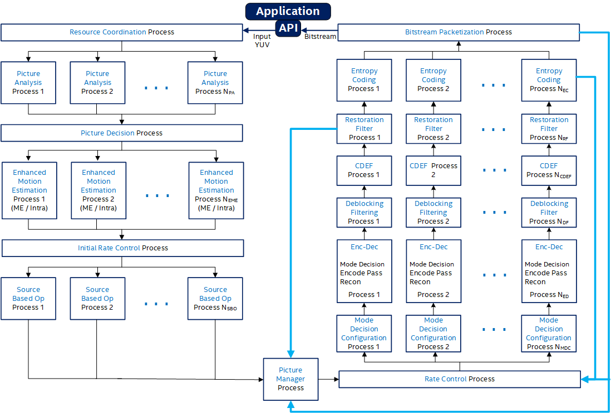

##### Figure 3. High-level encoder process dataflow.

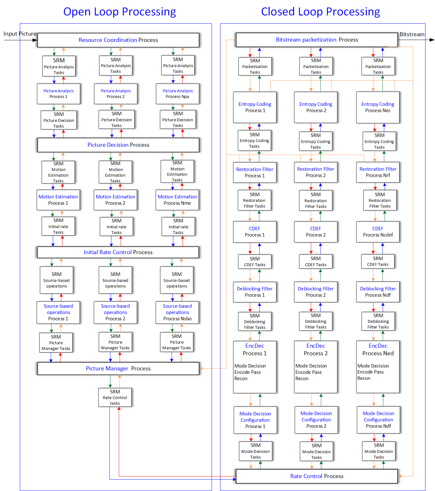

##### Figure 4. Detailed encoder process dataflow.

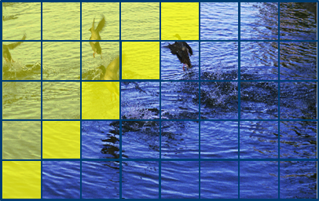

##### Figure 5. Illustration of segment-based processing: The squares in the picture represent segments. Light yellow segments have already been processed. Dark yellow segments are being processed in a parallel manner.

## Inter-process data and control management

*System resource managers* perform inter-process data and control
management. They manage *objects* and connect processes to one another
by controlling how objects are passed. Objects encapsulate data and
control information and are organized into four types: results, sequence
control sets, picture control sets, and picture descriptors. Objects are
described later in this section.

Figure 6 shows a block diagram of a system resource manager. As depicted
in the diagram, the empty object path begins when an empty object from the
empty object FIFO is assigned to one of N producer processes. The producer
process fills the empty object with data and control information and queues
the now full object onto the full object FIFO. In a manner similar to that of
the empty object path, the full object path begins when a full object from
the full object FIFO is assigned to one of M consumer processes. The consumer
process uses the information in the full object and completes the data path by
queuing the now empty object back onto the original empty object FIFO. To better
understand how the encoder block diagram in Figure 4 and the system resource manager
block diagram in Figure 6 relate to one another, we have used matching line colors to
indicate corresponding object flow. It is important to note that each encoder process
acts as both a producer and consumer of objects to processes occurring later, and
respectively, earlier in the encoder pipeline.

The system resource manager dynamically assigns objects to processes so
as to minimize idle process time. In addition, separate coordination of
the empty and full object paths allows a great deal of configuration
flexibility. This flexibility is important when, for example, producer
and consumer processes require differing amounts of computational
resources. In this case, a system resource manager may have N producers
and M consumers where N is not equal to M.

##### Figure 6: System resource manager dataflow.

### Objects

Objects encapsulate inter-process data and control information. While
the term object may have a wide variety of meanings, in this document
object shall be used exclusively to refer to four types of data and
control information: *sequence control sets, picture control sets,
picture descriptors, and results*. The objects are described in detail
below.

### Sequence Control Set

The sequence control set object contains a mixture of system resources
(e.g., system resource managers, a picture descriptor pool, API callback
functions, etc.) and encoder configuration parameters that may apply to
more than one picture (e.g., GOP length, prediction structure, number of
reference pictures, motion estimation search range, target bit rate,
etc.).

The data structures associated with sequence control set objects are
defined in EbSequenceControlSet.h.

### Picture Control Set

The picture control set object contains encoder configuration parameters
that apply to a single picture (e.g., picture descriptors, reference
lists, SB motion and mode information, etc.). The information carried by
the results object has a lifetime of at most one picture time interval.

The data structures associated with picture control set objects are
defined in EbPictureControlSet.h.

### Picture Descriptors

The picture descriptor object contains data and control information that
describe picture attributes. The input, enhanced, motion compensated
prediction, reconstructed, and reference pictures all have associated
picture descriptor objects. In addition, transform coefficients
generated in the coding loop process and consumed by the entropy coding
process have an associated picture descriptor. Examples of data and
control information conveyed by picture descriptor objects include:
color space, bit depth, picture dimensions, and pointers to memory
locations containing the picture data.

The data structures associated with picture descriptor objects are
defined in EbPictureBufferDesc.h.

### Results

The results object is used to convey data and control information
between two processes. Producer processes fill results objects while
consumer processes use the information conveyed in those objects. A
consumer process waits (i.e., blocks) for a results object to arrive
from the preceding producer process before commencing execution. Results
objects convey process state information explicitly in the case of
encoder parameters (e.g., bit depth, color space, etc.) and implicitly
in the case of system timing (e.g., when to begin execution).

The data structures associated with results objects are defined in
results header files, e.g, EbRateControlResults.h.

## System Resource Manager (SRM)

The system resource managers manage objects and connect processes to one
another by controlling how objects are passed. They provide the link
between processes through which nearly all inter-process communication
takes place. The encoder block diagram shows only system
resource manager associated with results objects. It is important to
understand that the encoder block diagram does not depict system
resource managers associated with other objects.

### Resource manager components

As shown in Figure 6, the system resource managers comprise many
individual components. These components are described in this
subsection.

#### Empty object FIFO

The empty object FIFO contains empty objects that have not yet been
assigned to a producer process. When an object is released, it is placed
back into the empty object FIFO. As with all objects, empty objects are
not restricted to use within the context of a single resource manager.
For example, sequence control set objects are passed throughout the full
encoder pipeline.

#### Producer empty object FIFO

The  producer empty object FIFO contains empty objects
that have been assigned to the  producer process. The
 producer process requires an empty object from the
 producer empty object FIFO in order to begin execution.
The  producer empty object FIFO is hardwired to the
 producer process.

#### Producer process

The producer process works to convert empty objects provided by its
producer empty object FIFO into full objects. The producer process
queues recently filled objects onto the full object FIFO. It is
important to understand that a process that is a producer process in a
system resource manager can simultaneously be a consumer process in a
different system resource manager. When a producer process completes its
task, it places itself on the producer process FIFO.

#### Producer process FIFO

The producer process FIFO contains producer processes waiting to be
assigned an empty object on which to work. Without the producer process
FIFO, producer processes would have to poll the empty object FIFO that
can lead to inefficiencies when the empty object FIFO contains no empty
objects.

#### Full object FIFO

The full object FIFO contains full objects that have not yet been
assigned to a consumer process. Only system resource managers that
manage results objects have full object FIFOs.

#### Consumer full object FIFO

The  consumer full object FIFO contains full objects that
have been assigned to the  consumer process. The
 consumer process requires an empty object from the
 consumer full object FIFO in order to begin execution.
The  consumer full object FIFO is hardwired to the
 consumer process.

#### Consumer process

The consumer process uses full objects provided by its consumer full
object FIFO. The consumer process queues used objects onto the empty
object FIFO. It is important to understand that a process that is a
consumer process in a system resource manager can simultaneously be a
producer process in a different system resource manager. When a consumer
process completes its task, it places itself on the consumer process
FIFO. System resource managers managing results objects are the only
resource managers with an associated consumer process. Sequence control
set, picture control set, and picture descriptor objects do not have
consumer processes.

#### Consumer process FIFO

The consumer process FIFO contains consumer processes waiting to be
assigned a full object to use. Without the consumer process FIFO,
consumer processes would have to poll the full object FIFO which can
lead to inefficiencies when the full object FIFO contains no full
objects.

### Resource manager execution flow snapshot

This subsection contains an execution flow snapshot whose purpose is to
show how the individual components of the system resource manager
interact with one another.

1.  The producer process produces a full object (dark green arrows)

2.  The full object demux queues the object in the full object FIFO

3.  The full object MUX checks the status of the consumer process FIFO.
    If the consumer process FIFO

    1.  is not empty then the first object in the full object FIFO is
        assigned to the first process identified in the consumer process
        FIFO. The assignment wakes the first process in the consumer
        process FIFO.

    2.  is empty, then the producer process requests an empty object
        from its empty object FIFO and continues to step 1

4.  The consumer process awoken in step 3a begins to work and consumes
    the full object (blue arrows)

5.  The consumer releases its used full object whereupon it is returned
    to the Empty Object FIFO (red arrows)

Note the following:
- Steps 1 and 2 are carried out by the producer process. Step 3 is
carried out in the system resource code, while steps 4 and 5 are
executed by the consumer process.

- The  producer process will not become active if the
 producer empty object FIFO contains no objects

- The  consumer process will not become active if the
 consumer full object FIFO contains no objects

- The tangerine arrows depict the producer processes’ acquisition of
empty objects and are not described in the execution flow snapshot
above.

## High-level Data Structures

There are many signals that are used throughout the encoder at various
stages and for various amounts of time. The following groups of signals
are used extensively throughout the encoder.

### Configuration Set

The configuration sets (EbSvtAv1EncConfiguration) are general settings that can be used to control
the encoder externally.

##### <a name = "table-1"> Table 1: Examples of Configuration Set Members. </a>

| **Signal**            | **Description**                                               |
| --------------------- | ------------------------------------------------------------- |
| frame\_rate           | Input frame rate                                              |
| intra\_period\_length | Interval between successive I-pictures                        |
| hierarchical\_levels  | The number of levels of hierarchy in the Prediction Structure |

### Sequence Control Set (SCS)

The Sequence Control Set contains information specific to the whole
sequence. The relevant data structure is SequenceControlSet\_s.

##### <a name = "table-2"> Table 2: Examples of Sequence Control Set Members </a>

| **Signal**               | **Description**              |
| ------------------------ | ---------------------------- |
| max\_input\_luma\_width  | Width of picture             |
| max\_input\_luma\_height | Height of picture            |
| profile\_idc             | Defines the encoding profile |
| level\_idc               | Defines the encoding level   |

### Picture Control Set (PCS)

The Picture Control Set contains the information for individually coded
pictures. The information is split between Picture Parent Control Set
and Picture Control Set. Picture Parent Control Set is used in the first few processes
in the pipeline (from Resource Coordination process to Source-Based Operations process). The Picture
control set includes a pointer to the Picture Parent Control Set and
includes also additional information needed in the subsequent processes
starting at the Picture Manager process. The relevant data structures
are PictureParentControlSet\_s and PictureControlSet\_s.

##### <a name = "table-3"> Table 3: Examples of Picture Parent Control Set Members </a>

| **Signal**                 | **Description**                                                               |
| -------------------------- | ----------------------------------------------------------------------------- |
| av1\_frame\_type           | 0 (KEY\_FRAME) to 3 (S\_FRAME)                                                |
| show\_frame                | 1/0: Display or not decoded frame                                             |
| is\_skip\_mode\_allowed    | 1/0: sets whether using skip modes is allowed within the current frame or not |
| allow\_high\_precision\_mv | 1/0 Enable/disable eighth pel MV precision                                    |
| base\_qindex               | quantization base index for the picture                                       |

### Picture Descriptors

Picture descriptors provide information on the various picture buffers
used in the encoder. The relevant data structure is
EbPictureBufferDesc\_s.

##### <a name = "table-4"> Table 4: Examples of Picture Descriptor Members </a>

| **Signal**              | **Description**                                                                          |
| ----------------------- | ---------------------------------------------------------------------------------------- |
| buffer\_y               | Address of the luma buffer                                                               |
| buffer\_cb              | Address of the Cb chroma buffer                                                          |
| buffer\_cr              | Address of the Cr chroma buffer                                                          |
| origin\_x               | Contains the x-padding offset of the picture buffer (luma)                               |
| origin\_y               | Contains the y-padding offset of the picture buffer (luma)                               |
| width                   | Luma picture width excluding padding                                                     |
| height                  | Luma picture height excluding padding                                                    |
| bit\_depth              | The bitdepth of the buffers                                                              |
| luma\_size              | The size (bytes) of the luma buffers                                                     |
| chroma\_size            | The size (bytes) of the chroma buffers                                                   |
| stride\_y               | The number of luma samples to increment a position to the next line (includes padding)   |
| stride\_cb / stride\_cr | The number of chroma samples to increment a position to the next line (includes padding) |

## Encoder Processes and Algorithms

The following section describes the processes and algorithms used in the
SVT-AV1 encoder. The first-level subsections describe the operation of
each concurrent process found in Figure 4. Second-level and
lower subsections describe high-level algorithm behavior and design
considerations.

### Resource Coordination Process

The Resource Coordination Process performs two functions, namely it
gathers input data and distributes encoder-setting changes properly into
the encoder pipeline. Input data is passed to the encoder in packets
that can contain varying amounts of data from partial segments of one
input pictures to multiple pictures. The Resource Coordination Process
assembles the input data packets into complete frames and passes this
data along with the current encoder settings to the Picture Analysis
Processes. Encoder settings include, but are not limited to Bitrate
Settings, Rate Control Mode of operation, etc.

### Picture Analysis Process

The Picture Analysis processes perform the first stage of encoder
pre-processing analysis as well as any intra-picture image conversion
procedures, such as resampling, color space conversion, or tone mapping.
The Picture Analysis processes can be multithreaded and as such can
process multiple input pictures at a time. The encoder pre-analysis
includes creating an n-bin histogram for the purpose of scene change
detection, gathering the  and  moment
statistics for each 8x8 block in the picture which are used to compute
variance, input subsampling and screen content detection. All
image-modifying functions should be completed before any
statistics-gathering functions begin.

#### Statistical Moments

The statistical moments of a picture are useful in a number of
algorithms in the encoder including rate control and mode decision
configuration. A useful property of the  and
 statistical moments is that blocks can be combined
together to find the mean and variance of larger block sizes, so with
the statistical moments of the 8x8 blocks, we can calculate the variance
of all blocks in the SB that are larger than 8x8.

Let the first and second moment-accumulations be defined as:

* Moment*:

* Moment*:

Variance is normally calculated as:

=E[(X-\mu)^2])

where,  is the input sample, and  is the mean of
the input samples.

This method requires an initial pass over the input samples to calculate
the mean, followed by a second pass to calculate the variance. However,
an alternate method can be used that requires only a single pass over
the input data:

=E[X^2]-(E[X])^2)

This form can be made more efficient:

Let }'=N^2*Var(X))

where  is the number of samples

So,

}'=N^2*E[X^2]-N^2*(E[X])^2)

It follows that

'=N*\sum_{i=0}^{N}X^2_{i}-\left(\sum_{i=0}^NXi\right)^2)

So the relative variance for an N-sized block can be calculated by:

'=N*Accum[X^2]-Accum[X]^2)

The relative variance can be calculated from two accumulations over each
region. In order to calculate the variance for all block sizes in a SB,
the first two moment-accumulations are first computed for each of the
8x8 blocks in a SB. If, for example, it is desired to compute the
relative variance of 16x16 blocks in a SB, the 16x16 block
moment-accumulations can be calculated from the four collocated 8x8
block-accumulations by adding them together. After the two
moment-accumulations are computed, the relative variance can be
calculated by modified relative variance calculation.

### Picture Decision Process

The Picture Decision process performs multi-picture level decisions,
including setting of the prediction structure, setting the picture type,
and scene change detection. Since the prior Picture Analysis process
stage is multithreaded, inputs to the Picture Decision Process can
arrive out-of-display-order, so a reordering queue is used to enforce
processing of pictures in display order. The algorithms employed in the
Picture Decision process are dependent on prior pictures’ statistics, so
the order in which pictures are processed must be strictly enforced.
Additionally, the Picture Decision process uses the reorder queue to
hold input pictures until they can be started into the Motion Estimation
process while following the proper prediction structure. The data flow
in the picture decision process is show in Figure 7.

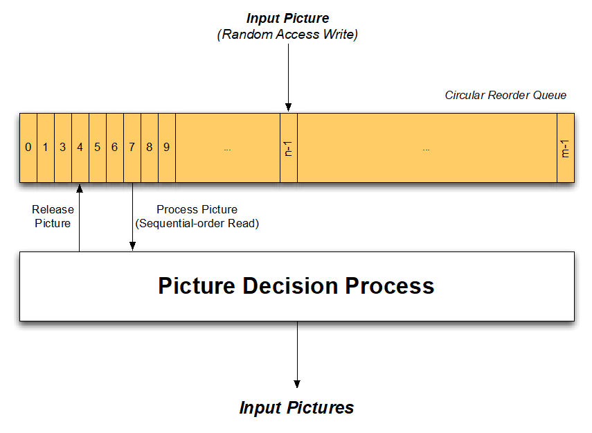

##### Figure 7: Picture decision process dataflow.

**Setting up the prediction structure**. To illustrate the process by
which a prediction structure is implemented, an example showing a
four-layer prediction structure is shown in Figure 8. The prediction
structure is implemented using the Show\_frame and Show\_existing\_frame
flags, as shown in the table below.

##### Figure 8. An example of a four-layer prediction structure.

##### <a name = "table-5"> Table 5: Settings for the show\_frame and Show\_existing\_frame flags when encoding one mini-GoP in a 4-layer prediction structure.</a>

| **PicNumber** | **Show\_frame** | **Show\_existing\_frame** | **DPB**        |
| --------- | ----------- | --------------------- | ---------- |
| 0         | 1           | 0                     | 0          |
| 8         | 0           | 0                     | 8-0        |
| 4         | 0           | 0                     | 4-8-0      |
| 2         | 0           | 0                     | 2-4-8-0    |
| 1         | 1           | 0                     | 2-4-8-0    |
| 2e        | 0           | 1                     | 2-4-8-0    |
| 3         | 1           | 0                     | 2-4-8-0    |
| 4e        | 0           | 1                     | 2-4-8-0    |
| 6         | 0           | 0                     | 6-2-4-8-0  |
| 5         | 1           | 0                     | 6-2-4-8-0  |
| 6e        | 0           | 1                     | 6-2-4-8-0  |
| 7         | 1           | 0                     | 6-2-4-8-0  |
| 8e        | 0           | 1                     | 6-2-4-8-0  |
| 16        | 0           | 0                     | 6-2-4-8-16 |

### Motion Estimation Process

The Motion Estimation (ME) process performs motion estimation and
open-loop intra search (OIS). This process has access to the current
input picture as well as to the input pictures the current picture uses
as references according to the prediction structure pattern. The Motion
Estimation process is multithreaded, so pictures can be processed out of
order as long as all inputs are available.

The ME process generates inter-prediction and intra-prediction
candidates using highly parallelizable, open loop, neighbor-independent
methods. The candidates’ costs generated in the ME processes are further
refined in downstream processes and as more neighbor information becomes
available allowing for more accurate costs to be calculated. ME consists
of four components: Hierarchical motion estimation (HME), search center
selection, Motion Estimation and open-loop intra candidate search (OIS).
The HME performs a quick search on down-sampled pictures to converge to
a candidate search center for full-pel motion estimation search at the
full picture resolution. Search center select uses a competition method
to select a single search center from several methods, including
hierarchical motion estimation, temporal motion vector predictors,
and/or external search center candidates. The search parameters of each
search center method can be configured at the picture-level in order to
control the number of computations used during search center selection.
One goal of this design is to eliminate large areas of the search area
with search center selection and then to fully search a smaller search
area with the refinement stage. Motion Estimation finds the best
motion vector around the SB search center for each of the partitions
being considered.

In the current SVT-AV1 encoder, the ME process is based on the input
pictures, i.e. the reference pictures are replaced by the corresponding
source pictures. As a result, the ME is an open loop operation.

OIS searches all available intra luma modes for each active block. Intra
chroma modes are not considered. The intra prediction process is
conformant with the AOM-AV1 specification; however, the intra reference
samples disregard filtering and use input samples rather than the
nominal reconstructed samples.

#### Hierarchical Motion Estimation

Hierarchical Motion Estimation (HME) takes as input an Enhanced Input
Picture and Reference Picture and produces a search center for each SB.
The HME consists of three stages: a one-sixteenth resolution Level-0
full search, a one-quarter resolution Level-1 refinement search, and a
base-resolution Level-2 refinement search as depicted in Figure 9. In
addition, the total search area is subdivided into *N*-search areas,
where each of the Level-0, Level-1, and Level-2 searches are performed
independently to produce *N*-search centers. Of the *N*-search centers,
one search center is finally selected. Having multiple search centers
prevents the Level-0 and Level-1 searches from choosing local minima and
missing the true center of motion completely. All search and selection
decisions are based on a pure SAD distortion metric. Figure 10 depicts
an example HME full search and refinement data flow through Level-0,
Level-1, and Level-2.

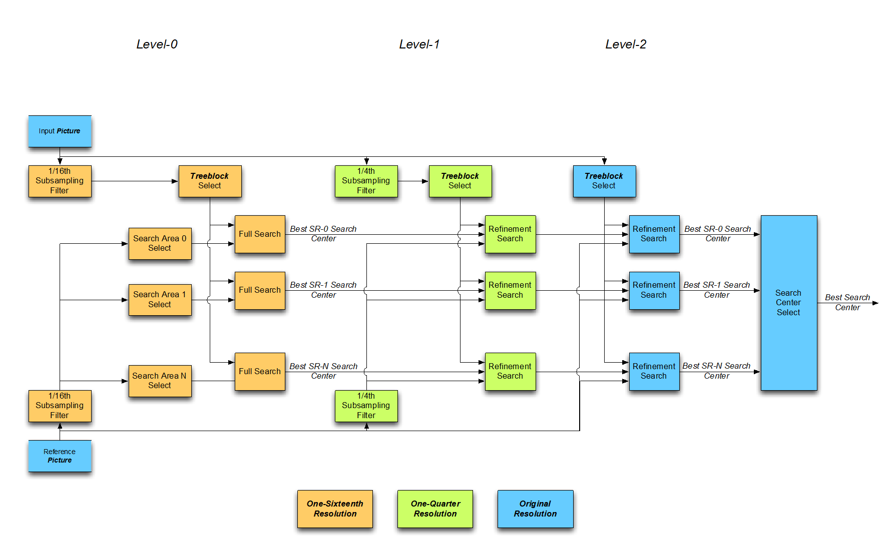

##### Figure 9: Hierarchical motion estimation dataflow.

##### Figure 10: Hierarchical motion estimation data illustration.

#### Search Center Selection

Search center selection chooses the best SB search center for
Motion Estimation based on a SAD Distortion Metric. Search Center
candidates may be generated from HME or other sources of candidate
search centers. A diagram showing search center selection and the
Motion Estimation is given in Figure 11.

#### Motion Estimation

Motion Estimation (ME) takes as input an enhanced input picture,
reference picture, and search center for each SB. ME produces Motion
Vector Pairs, one for each of the blocks in a SB. ME is composed of four
main components: Integer Full Search, Half-Pel Refinement Search,
Quarter-Pel Refinement Search, and the Search Area Quarter-Pel
Interpolation filter as depicted in Figure 12. First, the Integer Full
Search produces an integer MV candidate for each block. In parallel to
the Integer Full Search, the Search Area Quarter-Pel Interpolation
filter produces the quarter-pel interpolation for the Search Area. After
both the Integer Full Search and Search Area Quarter-Pel Interpolation
have completed, the Half-Pel Refinement process produces a half-pel
refined MV candidate for each block. Finally, the Quarter-Pel Refinement
process produces a quarter-pel refined MV candidate for each block and
the SB SAD estimation using the base 8x8 block SAD data. The filters for
each of the subsample locations can be configured independently as well
as the Search Area width and height.

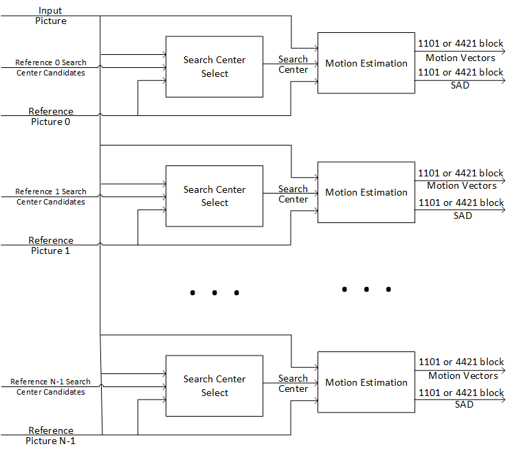

##### Figure 11: Search center select and motion estimation.

##### Figure 12: Motion estimation dataflow.

##### Motion Estimation Integer Full-Search

Motion Estimation Integer Full-Search (ME FS) takes as input an enhanced
input picture, reference picture, and search center for SB. ME FS
produces integer-resolution Motion Vector Pairs for each of the blocks in
the SB. ME FS performs a full search on the Search Area for every block
in each SB. The cost metric used in the search is composed only of a sub-sampled SAD
distortion. In order to avoid redundant SAD distortion calculations
among the blocks, the ME FS algorithm uses the 8x8 SAD blocks
(corresponding to the 8x8 blocks in a SB) at each search position to
construct the blocks as depicted in Figure 13. Blocks of size 4xN and
Nx4 use the motion vectors of the parent block and their corresponding
SAD is computed accordingly.

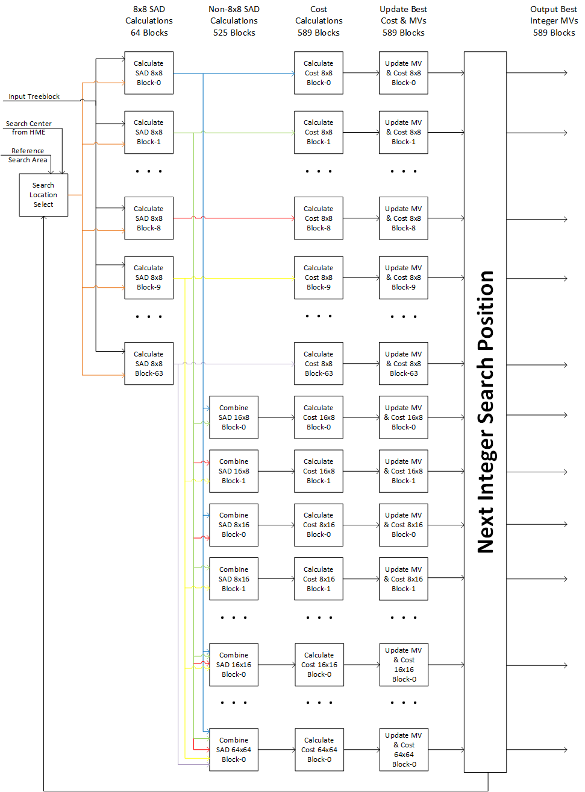

##### Figure 13: Motion Estimation Integer Full-Search for the case of 64x64 SB. 4xN and Nx4 blocks are not included in this diagram to keep the presentation simple.

##### Motion Estimation Half-Pel Refinement

Motion Estimation Half-Pel Refinement (ME HPR) takes as input an interpolated
enhanced input picture, an interpolated reference picture, a search center for
the motion vector difference (MVD) cost metric, and integer-resolution Motion
Vector Pairs. ME HPR produces half-pel resolution Motion Vector Pairs for each
of the blocks in each SB. Additionally, ME HPR also has a selectable refinement
area. The ME HPR algorithm is to refine each of the Motion Vector Pairs from
integer-resolution to half-pel-resolution as depicted in Figure 14. Since the
MV pairs are restricted to the Search Area, only the Search Area in the Reference
Picture needs to be interpolated. More details on the ME HPR are provided in the Appendix.

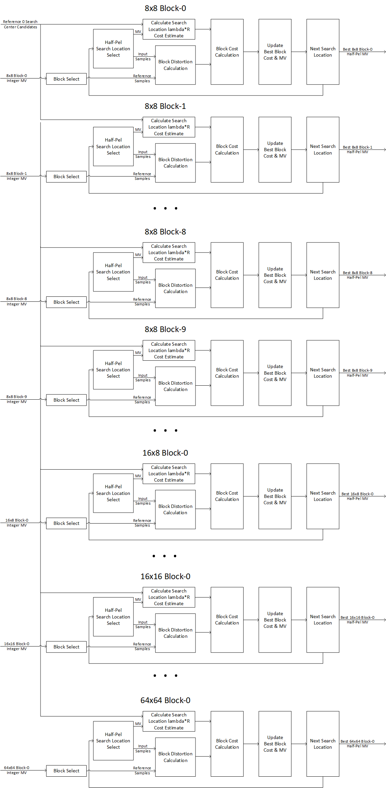

##### Figure 14: Half-Pel Refinement for the case of 64x64 SB. 4xN and Nx4 blocks are not included in this diagram to keep the presentation simple.

##### Motion Estimation Quarter-Pel Refinement

Motion Estimation Quarter-Pel Refinement (ME QPR) takes as input an interpolated
enhanced input picture, an interpolated reference picture, a search center for the
motion vector difference (MVD) cost metric, and half-pel-resolution Motion Vector
Pairs.  Additionally, ME QPR also has a selectable refinement area. The ME QPR
algorithm is exactly the same as the ME HPR algorithm, except that the Motion Vector
Pairs are being refined to quarter-pel resolution and distortion estimates. A
diagram of the ME QPR is shown in Figure 15. More details on the ME QPR are
provided in the Appendix.

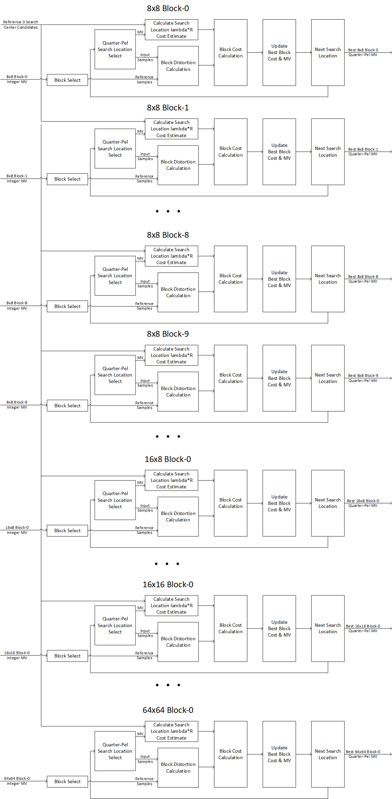

##### Figure 15: Quarter-Pel Refinement for the case of 64x64 SB. 4xN and Nx4 blocks are not included in this diagram to keep the presentation simple.

### Initial Rate Control Process

The Initial Rate Control process determines the initial bit budget for
each picture depending on the data gathered in the Picture Analysis and
Motion Estimation processes as well as the settings determined in the
Picture Decision process. The Initial Rate Control process also employs
a sliding window buffer to analyze multiple pictures if a delay is
allowed. Note that through this process, until the subsequent Picture
Manager process, no reference picture data has been used. The data flow
in the Initial Rate Control process is illustrated in Figure 16.

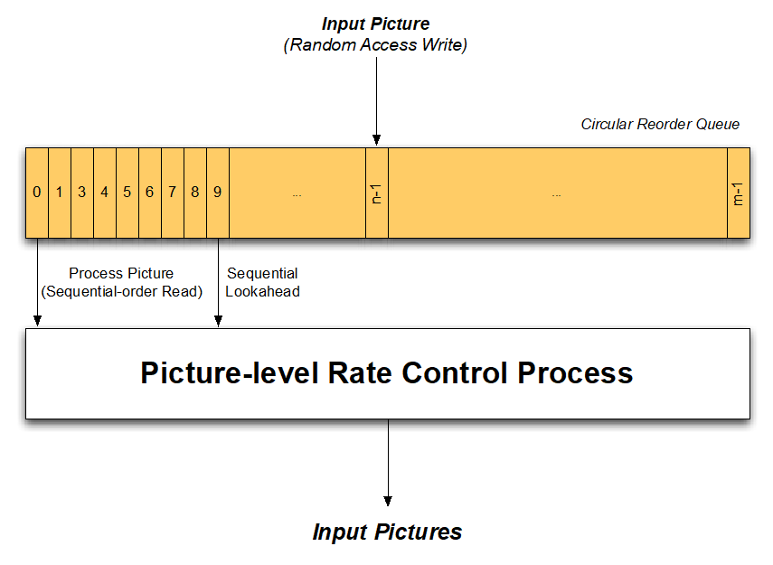

##### Figure 16: Initial Rate Control Process Dataflow.

### Source-based Operations Process

Source-based operations process involves a number of analysis algorithms to
identify spatiotemporal characteristics of the input pictures. Some of
the operations aim at characterizing individual SBs (e.g. grass areas),
others aim at characterizing whole pictures (e.g. Potential aura areas).

### Picture Manager Process

The Picture Manager Process performs the function of managing both the
Enhanced (Input) Picture and Reference Picture buffers and subdividing
the Input Picture into Tiles. Both the Enhanced Picture and Reference
Picture buffers particular management depends on the GoP structure
currently in use. The Picture Manager Process uses the Enhanced Picture
and Reference Picture buffers to implement Pyramidal B GoP structures.
Figure 17 shows the interaction of the Picture Management algorithm with
the Enhanced Input Picture and Reference Picture buffers.

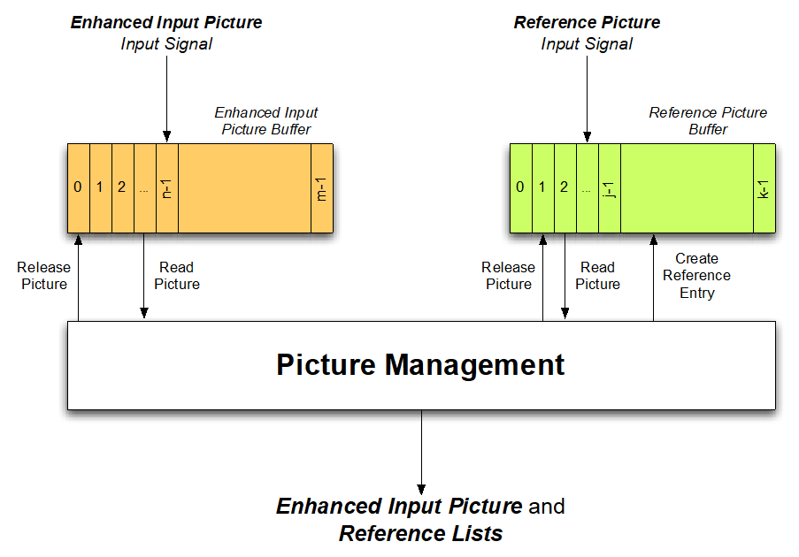

##### Figure 17: Picture Management Dataflow.

The Picture Manager Processes runs in an asynchronous mode of operation
where the Picture Management algorithm is run whenever an Enhanced Input
Picture or Reference Picture input are received. For both Enhanced Input
Pictures and Reference Picture inputs, the Picture is first placed in
the appropriate picture buffer. Then the Picture Management algorithm is
run.

The Picture Management algorithm walks the Enhanced Input Picture Buffer
and for each entry checks if the necessary Reference Pictures are
available in the Reference Picture Buffer. If all the References are
available, the encoding of the picture can start. Additionally, an
entry is made in the Reference Picture Buffer for the
now active Input Picture where the Input Picture’s finished Reference
Picture will be stored for future reference. This entry contains a
descriptor to the Reference Picture data and a count of the Expected
References by subsequent pictures in coding order. Finally, for each
Reference Picture in the Reference Lists, the expected reference count
for the Reference Picture’s corresponding Reference Picture Buffer entry
is decremented by one. Once the expected reference count is decremented
to zero, the Reference Picture’s entry is removed from the Reference
Picture Buffer. When the Picture Manager Process receives a Key\_Frame
flag or prediction structure reset, the Reference Picture Buffer entries
must be decremented properly to avoid memory leakage. All buffer
management actions are triggered by either receiving a Key\_Frame,
prediction structure reset, or upon the successful start of an Input
Picture into the pipeline.

### Rate Control Process

The Rate Control process uses the distortion and image statistics
generated in previous processes, the current picture’s bit budget, and
previous picture statistics to set the QP and the bit budget for each
picture. The encoder currently supports VBR -type of rate control.

### Partitioning, Mode Decision and Encoding

The next several steps in the encoder pipeline involve finalizing the
partitioning and mode decisions for each SB in the picture. Given the
large number of block sizes and the large number of modes that could be
considered for each block, it would be computationally very expensive to
evaluate all options using all available tools to converge on the final
partitioning and coding modes. Consequently, a staged decision
approach is considered in SVT-AV1 as shown in Figure 18. The process
starts with the very large number  of candidates at the
input of partitioning decision stage 0 (PD Stage 0). At this stage, very elementary tools and
performance measures are used in evaluating the fitness of the different
candidates. The best  of candidates are
selected and passed on to PD stage 1. More sophisticated prediction and
performance measure tools are considered in PD Stage 1 to evaluate all
the  input candidates and select the top
 from among the tested 
candidates. The same idea is applied in subsequent steps until PD Stage
n where   candidates and their corresponding coding modes
are selected.

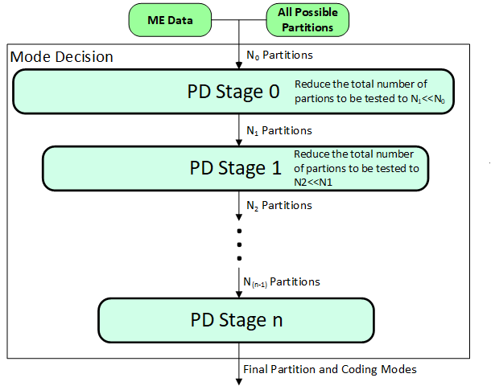

##### Figure 18. Partitioning decision stages.

An illustration of the different processing details that can take place
in each PD stage are given in Figure 19. In this example, PD Stage 0 is
based on the ME data. Candidate cost, which included the MV rate, is used
in making decisions to select the best subset of candidates to pass on to
PD Stage 1. The latter may involve more precise prediction tools and more
accurate cost calculations as part of the mode decision (MD) process to
select an even smaller subset of candidates to pass on to PD stage 2.
For example, PD Stage 1 may use more accurate interpolation filters in
the sub-pel search. The same idea is applied in subsequent stages. In the
last stage, only very few candidates as considered at the input and usually
the full set of high-performance prediction tools are used to finalize the
list of candidates.

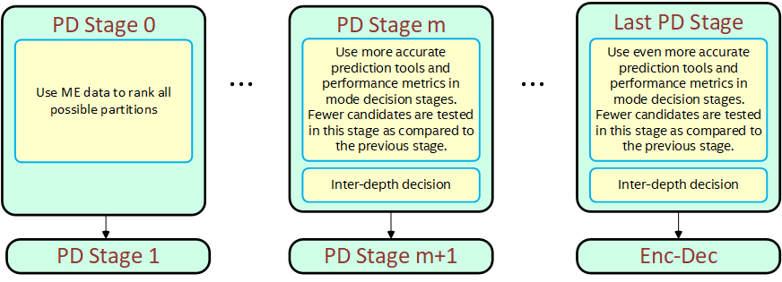

##### Figure 19. Example of the processing details in each PD stage.

The overall flow of the remaining tasks in the encoder is summarized in Figure 20.

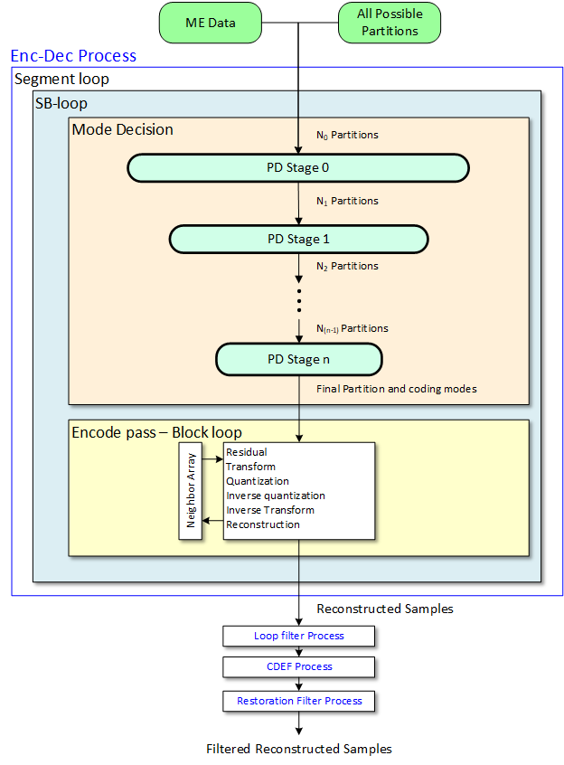

##### Figure 20. Partitioning, mode decision, encoding and filtering tasks.

### Mode Decision Configuration Process

The Mode Decision Configuration Process involves a number of initialization
steps, setting flags for a number of features, and determining the blocks to
be considered in subsequent MD stages.  Examples of flags that are set are
the flags for filter intra, eighth-pel, OBMC and warped motion and for updating
the cumulative density functions. Examples of initializations include
initializations for picture chroma QP offsets, CDEF strength, self-guided
restoration filter parameters, quantization parameters, lambda arrays, and
syntax, mv and coefficient rate estimation arrays.

The set of blocks to be processed in subsequent MD stages is decided in
this process as a function of the picture depth mode (pic_depth_mode).
Table 6 describes the different picture depth mode settings. Table 7
indicates the blocks that are considered in MD as a function of the
picture depth mode.

##### <a name = "table-6"> Table 6. Description of the picture depth mode settings. </a>

|**Picture Depth Mode (pic\_depth\_mode)**|**Description**|
|--- |--- |
|PIC_MULTI_PASS_PD_MODE_0 (0)|Multi-pass PD Mode 0: PD0, PD0_REFINEMENT|
|PIC_MULTI_PASS_PD_MODE_1 (1)|Multi-pass PD Mode 1: PD0, PD0_REFINEMENT, PD1, PD1_REFINEMENT using SQ vs. NSQ only.|
|PIC_MULTI_PASS_PD_MODE_2 (2)|Multi-pass PD Mode 2: PD0, PD0_REFINEMENT, PD1, PD1_REFINEMENT using SQ vs. NSQ and SQ coeff info.|
|PIC_MULTI_PASS_PD_MODE_3 (3)|Multi-pass PD Mode 3: PD0, PD0_REFINEMENT, PD1, PD1_REFINEMENT using SQ vs. NSQ and both SQ and NSQ coeff info.|
|PIC_ALL_DEPTH_MODE (4)|ALL sq and nsq: SB size -> 4x4.|
|PIC_ALL_C_DEPTH_MODE (5)|ALL sq and nsq with control : SB size -> 4x4.|
|PIC_SQ_DEPTH_MODE (6)|ALL sq: SB size -> 4x4.|
|PIC_SQ_NON4_DEPTH_MODE (7)|SQ: SB size -> 8x8.|
|PIC_OPEN_LOOP_DEPTH_MODE (8)|Early Inter Depth Decision: SB size -> 8x8.|
|PIC_SB_SWITCH_DEPTH_MODE (9)|Adaptive Depth Partitioning.|

##### <a name = "table-7"> Table 7. Blocks to be considered in MD as a function of picture depth mode. </a>
| **Picture Depth Mode (pic\_depth\_mode)**             | **Description**                                                                       |
| ----------------------------------------------------- | ------------------------------------------------------------------------------------- |
| PIC\_MULTI\_PASS\_PD\_MODE_0 (0)                      | All blocks are passed on to MD.                                                       |
| PIC\_MULTI\_PASS\_PD\_MODE_1 (1)                      | All blocks are passed on to MD.                                                       |
| PIC\_MULTI\_PASS\_PD\_MODE_2 (2)                      | All blocks are passed on to MD.                                                       |
| PIC\_MULTI\_PASS\_PD\_MODE_3 (3)                      | All blocks are passed on to MD.                                                       |
| PIC\_ALL\_DEPTH\_MODE (4)    | All blocks are passed on to MD.                                                       |
| PIC\_ALL\_C\_DEPTH\_MODE (5) | All blocks are passed on to MD with some restrictions. |
| PIC\_SQ\_DEPTH\_MODE (6)     | Only square blocks are passed on to MD. |
| PIC\_SQ\_NON4\_DEPTH\_MODE (7)      | Only square blocks that are at least 8x8 in size are passed on to MD.      |
| PIC\_OPEN\_LOOP\_DEPTH\_MODE (8)    | Generate a partitioning prediction to be passed on to MD.       |
| PIC\_SB\_SWITCH\_DEPTH\_MODE (9)    | Adaptive Depth Partitioning> The SB partitioning method is determined on a SB-basis.  |

### EncDec Process

The EncDec process currently encapsulates the PD stages where many
of the encoder tasks such as Intra Prediction, Motion Compensated
Prediction, Transform, Quantization and Mode Decision are performed.
It takes as input the Motion Vector XY Pairs and distortion estimations
from the Motion Estimation process, and the picture-level QP from the
Rate Control process. The EncDec process operates on an SB basis.

#### Neighbor Array

The Neighbor Array is a structure that manages neighboring block
information in the EncDec process by continuously updating its
memory locations throughout the encoding process. The Neighbor Array
replaces the normal entire-picture block array solutions that are used
to access neighboring block data. There are three neighbor array types:
Top block, Left block, and Top-left block as illustrated in Figure 21.
Also note that the neighbor array design can store either mode
information directly or reference data indirectly (e.g. pointers).

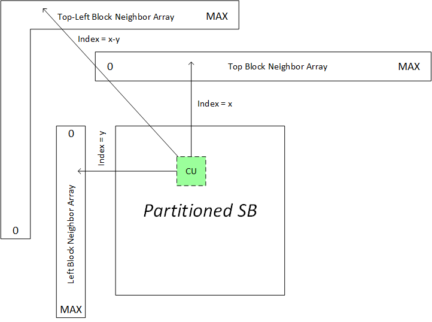

##### Figure 21: Neighbor array structure.

The Neighbor Array design hinges on how its memory locations are
accessed and updated. The Left Neighbor Array is approximately one SB
tall and is accessed by using the SB y-location of the current block.
The Top Neighbor Array is approximately one Picture wide and is accessed
by using the x-location of the current block. The Top-Left Neighbor
Array is accessed as seen in Figure 21.

The basic processing flow is that at the beginning of a picture, each of
the Neighbor Arrays is reset. As each block is completed, its mode
information or reference information is written to each of the
Neighbor Arrays using the appropriate index. The Neighbor Array update
and access flow can be described as follows:

1.  Construct neighbor information using the Neighbor Arrays

2.  Block Mode Decision

3.  Update each of the Neighbor Arrays using the current block location

4.  If at a partitioning (Quadtree or otherwise) mode decision point, update the neighbor array

5.  Proceed to the next block

This process is illustrated in Figure 22. The arrows represent the block
z-scan coding order and the colors represent each block’s mode
information. The three neighbor arrays contain a snapshot of the mode
information currently stored in each block position at the time that the
block labeled “Current Block” is being processed.

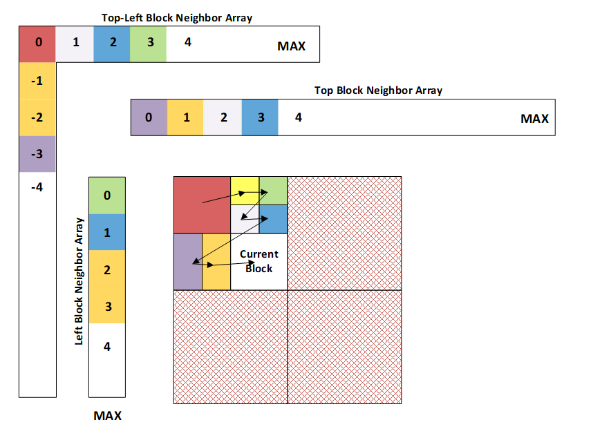

##### Figure 22: Neighbor array data illustration.

#### Rate Estimation Tables

The SVT-AV1 encoder makes use of the AOM AV1 encoder rate estimation
tables.

#### Candidate Types

The AOM-AV1 specification provides various means to encode each block,
which are grouped together into candidate types by syntax element usage
for this design. Each candidate type has its own sample prediction, rate
estimation, and transform block coding requirements. The candidate types
are Intra, Inter, and Compound.

##### Intra Candidates

Intra candidates are predicted for each block. Intra candidates are
searched by their luma/chroma modes. The search includes also Chroma
from Luma (CfL) search, Intra block copy (IBC). More details on the Cfl
and the IBC modes are provided in the Appendix.

##### Inter Candidates

Motion estimation candidates are inter predicted for each block. ME
candidates (NEWMV mode) use MVP to signal the motion vector values. The
skip mode in AV1 is considered only for NEAREST/NEAREST inter mode
candidates. The mode determination is made by performing rate distortion
optimization (RDO) analysis.

##### Compound Candidates

Compound candidates are generated using either inter-intra compound mode
(which include the smooth inter-intra prediction and inter-intra wedge
prediction), or inter-inter compound mode (which includes inter-inter
wedge prediction, distance-weighted inter-inter prediction, and
difference-weighted inter-inter prediction). Details on the different
compound modes are included in the Appendix.

#### Encode SB

Encode SB performs RDO analysis on each candidate mode for each block and sets
the partitioning structure, sets syntax elements, produces
AV1-conformant reconstructed samples. The two main tasks that are
performed in the encode SB are the mode decisions tasks and the encode
pass tasks, both outlined below.

##### Mode Decision

The mode decision takes place in each of  the PD Stages 0 to n. In the
current implementation, n=2. The mode decision tasks performed in each
PD stage are structured as shown in Figure 23. The input candidates to
a PD stage are grouped according to classes. In the current implementation,
there are nine classes corresponding to Intra, Inter (NEWMV), MV Pred
(Nearest, Near…), Inter-Inter compound, Intra-Inter compound, OBMC,
Filter Intra, Palette prediction and Global Motion candidates. Moreover,
multiple MD stages are involved in each PD stage, where the complexity
of the MD stages increases from MD Stage 0 to MD Stage  due to the
use of more accurate prediction tools and more accurate performance
measures. Once the input candidates to a given MD stage are processed,
only the best among the processed candidates are passed on to the next
MD stage, hence reducing the number of candidates to be processed in the
subsequent stage. In the process, some classes might be retired
(not considered in subsequent MD stages) if the performance of their
corresponding candidates is not satisfactory. The main idea behind
introducing candidate classes it to ensure that important types of
candidates are given a chance to be present in the final MD stage
and to compete at that stage against the best from other candidate classes.

It should be noted that the prediction tools considered in MD are not
necessarily conformant tools, as the objective of MD is to produce
partitioning and mode decisions, and not necessarily residuals to be
coded and transmitted in the bitstream, which is the task performed by
the encode pass discussed next.

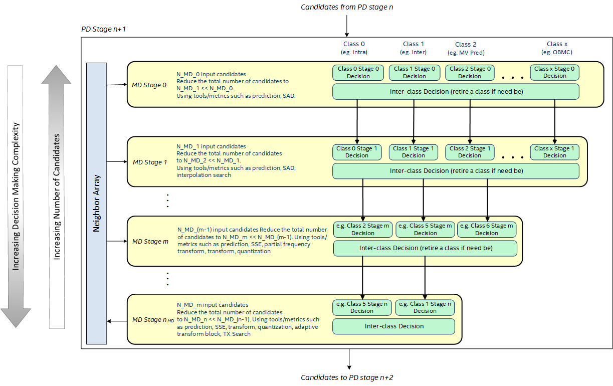

##### Figure 23. MD flow in a single PD stage.

##### Encode SB

The encode pass takes as input the selected partitioning and
coding modes from mode decision for each SB and produces quantized transform
coefficient for the residuals and syntax elements that would be included in an AV1
conformant bit stream. The encode pass includes intra prediction,
motion compensation, transform, quantization, inverse quantization,
inverse transform and reconstruction. All the prediction tools
considered in the encode pass are conformant tools.

### Loop Filter Process

The deblocking filter is used to address blocking artifacts in
reconstructed pictures. The filter was developed based on VP9 deblocking
filter and switches between two types of filters: Narrow filters and
Wide filters. Filtering is applied to all vertical edges first, then to
all horizontal edges.

The steps involved in the deblocking filter are as follows:

1.  Determine the loopfilter level and sharpness. Both are frame level parameters.
    * The level takes value in \[0, 63\] and can be set using different methods:

      * 0 to disable filtering,

      * Can be set as a function of the AC quantization step size, or

      * Can be set through evaluation of filtering using multiple levels and selecting the level with the lowest distortion in the filtered frame.

    * The sharpness takes value in \[0, 7\]. For keyframes, sharpness=0, else sharpness is set to the input sharpness setting.

2.  Identify edges to filter.

3.  Determine adaptive filter strength parameters: lvl, limit, blimit
    and thresh. These are block level properties. They build on the
    frame level settings and include refinements based on segmentation,
    coding mode, reference picture and loop filter data.

4.  Determine filter masks: High edge variance mask (hevMask),
    fiterMask, flatMask and flatMask2.

5.  Select and apply filters.

A more detailed description of the deblocking loop filter is presented in the Appendix.

### Constrained Directional Enhancement Filter Process

The constrained directional enhancement filter (CDEF) is applied after
the deblocking filter and aims at improving the reconstructed picture.
CDEF is a combination of the directional de-ringing filter from the
Daala codec and the Constrained Low Pass Filter (CLPF) from the Thor
codec, and provides directional de-ringing filtering and constrained low-pass filtering (CLPF).
The filtering is applied on an 8x8 block level.

The filtering algorithm involves the following steps:

  1. Identify the direction of the block (i.e. direction of edges). Eight directions (0 to 7) could be identified. The search is performed on an 8x8 block basis. The search is performed for the luma component and the direction is assumed to be the same for the chroma components.

  2. Apply a nonlinear filter along the edge in the identified direction.
      * Primary filtering: Filter taps are aligned in the direction of the block. The main goal is to address ringing artifacts.

      * Secondary filtering: Mild filter along a 45 degrees direction from the edge.

The filtering operation is a function the pixel value difference between
the pixel being filtered and a neighboring pixel, the filter strength
and the filter damping. The strength determines the maximum difference
allowed. Damping determines where filtering would not be considered.

Signaling:
  * The frame is divided into 64x64 filter blocks.

  * Information signaled at the frame level: Damping, the number of bits used for filter block signaling, and a list of presets (could be 1, 2, 4 or 8 presets).

  * A preset specifies luma and chroma primary strengths, luma and chroma secondary strengths.

  * At the filter block level, the preset to use for the filter block is signaled.

More details on the CDEF algorithm and its implementation in SVT-AV1 are
included in the Appendix.

### Restoration Filter Process

The restoration filter is applied after the constrained directional
enhancement filter and aims at improving the reconstructed picture. Two
types of filters are involved:

  * Separable Symmetric Wiener Filter where only half of the filter coefficients are included in the bit stream due to symmetry.

  * Self-guided restoration filter with subspace projection that has the effect of edge preserving smoothing.

Switching between OFF, Wiener filter and the self-guided restoration
filter can be performed on a restoration unit basis.

A more detailed description of the restoration filter is presented in the Appendix

### Entropy Coding Process

The Entropy Coding process is responsible for producing an AV1
conformant bitstream for each frame. It takes as input the coding
decisions and information for each block and produces as output the
bitstream for each frame. The entropy coder is a frame-based process and
is based on multi-symbol arithmetic range coding.

### Packetization Process

The Packetization process gathers the bitstreams from each frame, codes
the Temporal Delimiter (TD) as well as the sequence and frame headers,
and serves as an end-point for the encoder pipeline. The Packetization
process takes as input the bitstreams for each frame as well as sequence
and picture level coding settings and produces the final bitstream in
picture-decoding order.

## Detailed Feature Implementation Design Appendices

The following appendices highlight the design and implementation of features in much greater detail than this document.

- [Altref Appendix](Appendix Alt Refs)
- [CDEF Appendix](Appendix CDEF)
- [CfL Appendix](Appendix CfL)
- [Compliant Subpel Interpolation Filter Search Appendix](Appendix Compliant Subpel Interpolation Filter Search)
- [Deblocking Loop Filter (LF) Appendix](Appendix DLF)
- [Filter Intra Appendix](Appendix Filter Intra)
- [Global Motion Appendix](Appendix GM)
- [Intra Block Copy Appendix](Appendix Intra Block Copy)
- [Local Warped Motion appendix](Appendix Local Warped Motion)
- [OBMC Appendix](Appendix OBMC)
- [Palette Prediction Appendix](Appendix Palette Prediction)
- [Restoration Filter Appendix](Appendix Restoration Filter)
- [Subpel Interpolation in the Open Loop Motion Estimation Appendix](Appendix Subpel Interpolation Open Loop ME)

## References

## Legal Disclaimer

The notices and disclaimers can be found [here](Notices).
